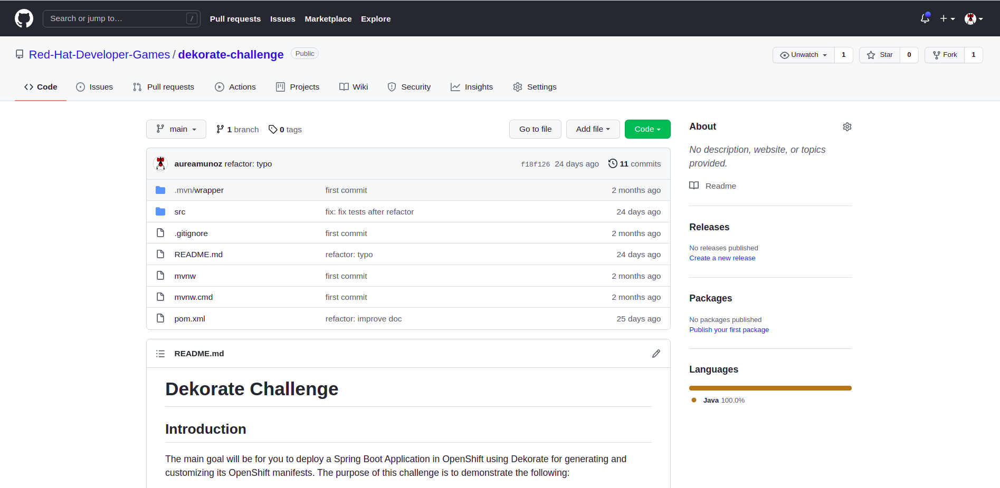
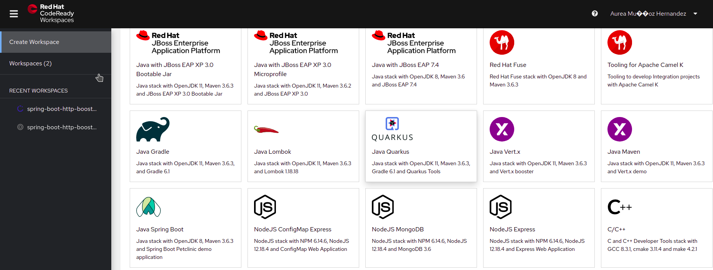
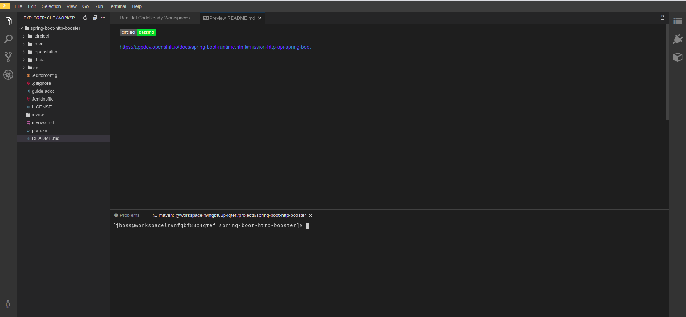
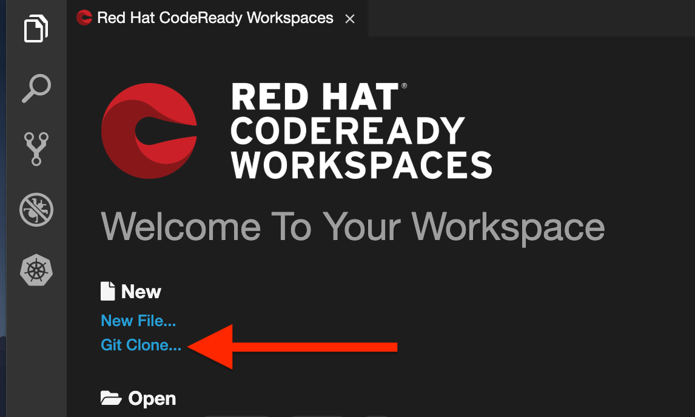

# Dekorate Challenge

## Introduction

The main goal will be for you to deploy a Spring Boot Application in OpenShift using Dekorate for generating and customizing its OpenShift manifests.
The purpose of this challenge is to demonstrate the following:

- How you can use the openshift-spring-starter which contains all the required modules, including the annotation processors that detect spring web applications.
- How Dekorate detects that this is a web app and automatically configures services.
- How you can trigger a container image build after the compilation.

If you have never used Dekorate before, I recommend checking the [Dekorate github repository](https://github.com/dekorateio/dekorate#readme) where you will find a complete documentation of the project with plenty of [examples](https://github.com/dekorateio/dekorate/tree/master/examples). 
There also are a couple of very useful blog posts to have a global vision about how to use Dekorate:
- [Dekorate for creating K8s manifests](https://developers.redhat.com/blog/2019/08/15/how-to-use-dekorate-to-create-kubernetes-manifests)
- [Dekorate for frameworkless applications](https://developers.redhat.com/blog/2021/03/17/using-dekorate-to-generate-kubernetes-manifests-for-java-applications)

## Prerequisites

First, make sure you have a Web browser installed on your laptop and internet connectivity. You will also need a GitHub account.

You can complete this challenge using either your own local environment or the remote one that we are providing you.

This workshop will make use of the following software and tools that you will need to install if you are using your own local environment:
- an IDE
- JDK 8+ installed with JAVA_HOME configured appropriately
- Apache Maven 3.6.3+
- Access to an OpenShift cluster (we will provide it)
- The `oc` CLI utility (Optional. Only required for manually deploying)

If you don't have the above tools and don't want to spend time installing them, you can also use the Code Ready Workspace that we will provide.
This remote development environment can be accessed via CodeReady Workspaces (CRW) through your local browser, you just need to sign up and configure some elements. Your environment includes also Red Hat’s OpenShift Container Platform (OCP).

However you decide to work (with a local development environment or the remote one using Code Ready Workspaces) the first thing that you have to do is forking this repository. As this exercise is focused on the deployment of a simple Spring Boot Microservice Application, you are provided with the code for such application. It is a minimal Hello World application based on Spring Boot. The code is available on the `src` folder of this repo.
Forking a repository allows to create a copy of the repository in your own GitHub account, this way we avoid conflicts by pushing to the same remote repository. 

To fork the original repo, click in the `Fork` button in the upper-right corner:



NOTE: Choose your own GitHub account as destination.

If you are not in a CodeReady Workspaces mood, just scroll to [Set up](#set-up)

### CodeReady Workspaces

CodeReady Workspaces is a collaborative Kubernetes-native development solution that delivers OpenShift workspaces and in-browser IDE for rapid cloud application development.


#### CRW access

- Choose an user. This user will be used to access the CRW and the OpenShift Web Console.
- Launch the CRW creation by clicking the CodeReady Workspaces link (specific to your team) mentioned in the access data email.
- Once the CRW creation done, access to your CRW and sign up with your own user (selected previously) and full fill the form:

  user: USERNAME
  
  pwd: openshift  
  
  email: USERNAME@ocp.com  
  
  first name: John  
  
  last name: Sanchez


If everything goes well, you should have land to the Workspace creation page:



You can now create your workspace either using a template (the Spring Boot template).
Once created you should have a CodeReady Workspace ready to start to code:



Now, you need to get the code of the application that you are going to deploy. For that use the `Git Clone` option proposed by CRW:



Finally, open a terminal from the Terminal menu -> Open Terminal in specific container -> maven and make sure the following commands work on your CRW terminal

```
$ java -version
$ mvn -version
$ curl --version
```

### OpenShift Container Platform

Your environment includes Red Hat's OpenShift Container Platform (OCP).

Access to your OCP resources can be gained via both the `oc` CLI utility and the OCP web console (you should have received the URL by email)

The project we are going to develop will contain 1 microservices accessing to a PostgreSQL database.
In the terminal of your CRW, authenticate into OpenShift as a non cluster admin user (USERNAME) using the `oc` utility.

NOTE: You can get the command for authenticating from the OpenShift Web Console.

```
$ oc login
```

There are 2 namespaces (OpenShift projects) in your OpenShift cluster:
The namespace for hosting your CRW environment is USERNAME-codeready where `USERNAME` correspond to your specific username.
The namespace for hosting the microservice is USERNAME-dekorate-challenge.

NOTE: change the USERNAME with your own.

## Set-up

Once you have forked the repository, you can clone it in order to have the code in your local machine:

```shell
git clone $URL/dekorate-challenge
```

## Let's code

As already mentioned, you are provided with the code of the application. It is a minimal Hello World application based on Spring Boot and Maven. The code is available on the `src` folder of this repo.
Navigate to the directory and build the project by running the following command:
```
mvn package
```
You can launch the application by running `mvn spring-boot:run` or `java -jar target/dekorate-challenge-1.0-SNAPSHOT.jar`.
Then, open a browser to [http://localhost:8080](http://localhost:8080) and verify that the `Hello world` message is shown. Now you are set for starting to use Dekorate.


Congratulations! Your environment is now ready to use. Once you have done the needed actions to enable and configure Dekorate, the OpenShift manifests are available in the `target/classes/META-INF/dekorate` directory. As mentioned in the different documentation resources, it is generated at every `mvn compile` launching.


## Bonus track (optional)
This challenge comes with 1 bonus track where you will learn how to configure the image build strategy that OpenShift will use. Apart from S2I for OpenShift, Dekorate currently supports Docker and Jib as image build strategies, use `Jib` to complete this part.


:warning::warning::warning: **NOTE** :warning::warning::warning:
If you use Codeready Workspaces, it will not be possible to use Docker as Image Build Strategy because `docker` is not available in this environment.

Dekorate will NOT push images on its own. If the Image Build Strategy is configured for using Docker, it will delegate to the docker binary. So the user needs to make sure beforehand they are logged in and have taken all necessary actions for a docker push to work.
**So, use `Jib` to complete this part in CRW.**


Remember to deploy the application on the OpenShift cluster using the manifests generated by Dekorate. 


## Help
Once the manifests have been generated under the `target/classes/META-INF/dekorate` directory, you can deploy the application to the OpenShift cluster by running the following commands:
```shell
oc login
oc project $USERNAME-dekorate-challenge
oc apply -f target/classes/META-INF/dekorate/openshift.yml
```

NOTE: If the $USERNAME-dekorate-challenge namespace doesn't exist, you can create it by running: `oc new-project USERNAME-dekorate-challenge` .

Or if you prefer, you can also use the hooks provided by Dekorate ;-) and do it in a single step:

```shell
mvn clean package -Ddekorate.build=true -Ddekorate.push=true -Ddekorate.deploy=true
```
Note that depending on the Image Build strategy you are using some of these flags might not be needed. Also, you may need to be logged in to an Image Registry in order to be able to push the container image.

As deliverables, we would like to have the url of the Spring Boot Application deployed on OpenShift and a github repository containing the code that you should have modified to generate/customize the OpenShift manifests.

## Deliverables:
In order to verify that the challenge has been completed, we expect a file containing the url to access the microservice on OpenShift and the url to the GitHub repository containing the code. (.txt doc with 2 urls).


## Need help?

Remember that we are all here to answer any questions and support you during all the Developer Games:

DevelopergamesEMEA@redhat.com

Happy Developer Games!
